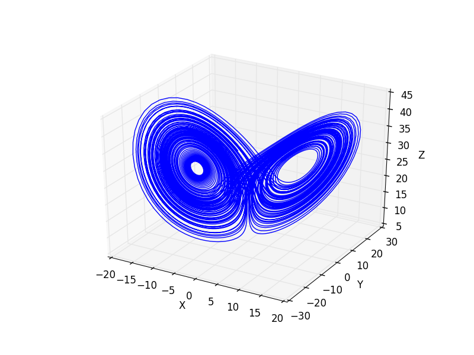

ndarray-odeint [](https://travis-ci.org/termoshtt/ndarray-odeint)
===============

solve ODE with rust-ndarray

Example
--------

```rust
let l = |y| odeint::lorenz63(10.0, 28.0, 8.0 / 3.0, y);
let ts = odeint::TimeSeries {
    teo: |y| odeint::rk4(&l, 0.01, y), // Time-Evolution Operator
    state: arr1(&[1.0, 0.0, 0.0]), // inital state
};
let end_time = 10000;
for v in ts.take(end_time) {
    println!("{} {} {}", v[0], v[1], v[2]); // output as ASCII
}
```

You can find complete code at src/main.rs



This figure is plotted by [gnuplot](http://www.gnuplot.info/)
